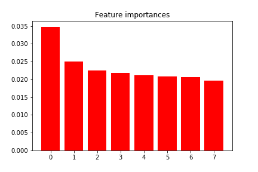

# Big Data Analytics FirstHomework(M10515066)

## (1) 哪些屬性對於惡意程式分類有效？

Feature ranking:

1. ent_q_diff_diffs_1_median (0.0268)
2. Img35 (0.0237)
3. ent_p_7 (0.0216)
4. FreeEnvironmentStringsA (0.0195)
5. ent_p_9 (0.0186)
6. Img31 (0.0185)
7. ent_p_4 (0.0181)
8. ent_q_diff_block_2_0 (0.0167)

---

## (2) 哪些屬性對於惡意程式分類無效？

1. align, 0.0
2. BASS, 0.0
3. HWND, 0.0
4. WPARAM, 0.0
5. entry, 0.0

---

## (3) 用什麼方法可以幫助你決定上述的結論？

**方法1**使用random forest演算法來進行選擇

**方法2**嘗試計算其F-value，再去看其中的關係

---

## (4) 透過Python哪些套件以及方法可以幫助你完成上面的工作？

pandas、numpy、matplotlib、sklearn

---

## (5) 課程迄今有無建議？

課程相當有趣，但在實際方法解說時，可能因為沒有data分析的經驗或著沒有修過統計，沒有很清楚的了解分析data的方法。

---

# Reference

1. [Random forest](https://en.wikipedia.org/wiki/Random_forest)
2. [skleanr](http://scikit-learn.org/stable/modules/feature_selection.html)
3. [https://github.com/ManSoSec/Microsoft-Malware-Challenge](https://github.com/ManSoSec/Microsoft-Malware-Challenge)